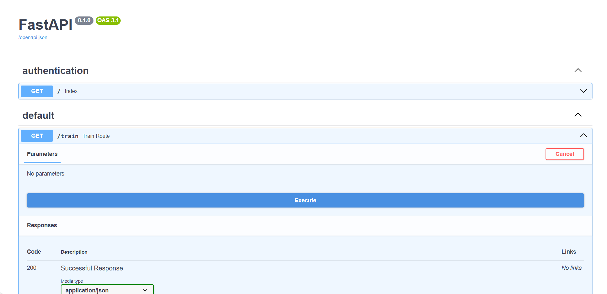
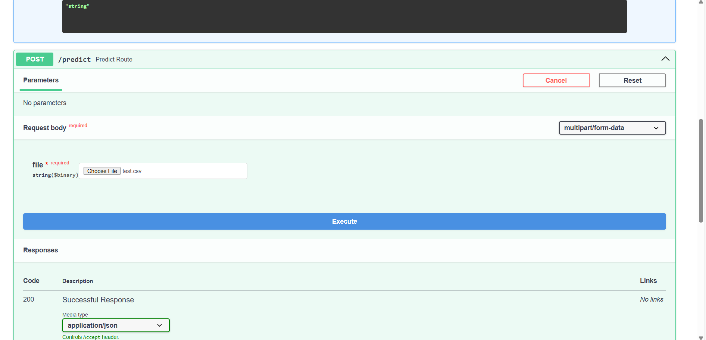

# Website Classification Project

## 🌟 Overview

This project is an **end-to-end Machine Learning pipeline** designed to classify websites as **malicious or safe** based on 30 carefully chosen features. The solution leverages a modular architecture to ensure each component of the pipeline is reusable and extendable, culminating in a robust and scalable deployment hosted on **AWS EC2** with **FastAPI**.

## 🚀 Key Features

- **Data Ingestion**: Extracts, transforms, and loads data from a local source to MongoDB Atlas Cloud and vice versa.
- **Data Validation**: Ensures the integrity of training and test datasets, including checks for schema consistency and data drift.
- **Data Transformation**: Preprocesses data using techniques like KNN Imputation, saved as reusable objects.
- **Model Training**: Employs hyperparameter tuning with Random Forest, Decision Tree, Gradient Boosting, and AdaBoost.
- **Model Tracking**: Logs metrics like F1 Score, Precision, and Recall (> 0.97) to **MLflow**, hosted on DagsHub.
- **Model Deployment**: Dockerized and deployed to **AWS EC2** using CI/CD pipelines and FastAPI.

---

## 📊 Dataset

- **Rows**: 11,055
- **Columns**: 30 Features + 1 Target Column
- **Target**: `Result` (Indicates whether the website is malicious or safe)
- **Features**:
  - `having_IP_Address`, `URL_Length`, `Shortining_Service`, `having_At_Symbol`
  - `double_slash_redirecting`, `Prefix_Suffix`, `having_Sub_Domain`, `SSLfinal_State`
  - `Domain_registration_length`, `Favicon`, `port`, `HTTPS_token`, `Request_URL`
  - `URL_of_Anchor`, `Links_in_tags`, `SFH`, `Submitting_to_email`, `Abnormal_URL`
  - `Redirect`, `on_mouseover`, `RightClick`, `popUpWindow`, `Iframe`
  - `age_of_domain`, `DNSRecord`, `web_traffic`, `Page_Rank`, `Google_Index`
  - `Links_pointing_to_page`, `Statistical_report`

---

## 🛠️ Modular Pipeline

### 1. **Data Ingestion**

- Transforms and loads data into **MongoDB Atlas Cloud**.
- Extracts data from MongoDB to local storage to minimize cloud calls.

### 2. **Data Validation**

- Validates feature types and names across training and test datasets.
- Detects data drift using statistical tests.
- Saves validated datasets for subsequent stages.

### 3. **Data Transformation**

- Preprocesses data using **KNN Imputer**.
- Dumps the preprocessing pipeline into a `preprocessor.pkl` file.
- Transformed data is saved for model training.

### 4. **Model Training**

- Hyperparameter tuning with the following algorithms:
  - **Random Forest**
  - **Decision Tree**
  - **Gradient Boosting**
  - **AdaBoost**
- Best model metrics:
  - **F1 Score**: 0.97+
  - **Precision**: 0.97+
  - **Recall**: 0.97+
- Logs best model and metrics to **MLflow** hosted on **DagsHub**: [View MLflow UI](https://dagshub.com/himanshugautam0910/networksecurity.mlflow/#/experiments/0/runs/39ae70b1cbc34210a6c34a7792bf35db)

### 5. **Model Deployment**

- Pushes `preprocessor.pkl` and `model.pkl` to **AWS S3 Bucket**.
- Builds a **FastAPI** application for real-time predictions.
- Creates a **Docker Image** of the application.
- Deploys the application to **AWS EC2** using **CI/CD Pipelines** with AWS App Runner.





---

## 📂 Project Structure

``` plaintext

├── .github/                 # GitHub workflows and CI/CD configurations  
├── data_schema/             # Schema definition for data validation  
├── final_model/             # Directory for trained models and preprocessor  
├── images/                  # Images for visualizations and README  
├── Network_Data/            # Dataset used for network security analysis  
├── networksecurity/         # Core project modules (exception handling, logging, pipeline, utils, etc.)  
├── prediction_output/       # Directory for prediction output files  
├── templates/               # HTML templates for FastAPI responses  
├── valid_data/              # Validated data storage  
├── .gitignore               # Files and directories to be ignored by git  
├── app.py                   # FastAPI application entry point  
├── Dockerfile               # Docker configuration for deployment  
├── push_data.py             # Script to push data to MongoDB  
├── README.md                # Project documentation  
├── requirements.txt         # Python dependencies  
├── setup.py                 # Project setup configuration  
├── test_mongodb.py          # Test script for MongoDB connection  

```
---

## 🔧 How to Run Locally

### Prerequisites

- Python 3.8+
- MongoDB Atlas account
- AWS CLI configured

### Steps

1. Clone the repository:
   ```bash
   git clone https://github.com/your-username/website-classification.git
   cd website-classification
   ```
2. Install dependencies:
   ```bash
   pip install -r requirements.txt
   ```
3. Run the FastAPI application:
   ```bash
   uvicorn app.main:app --host 0.0.0.0 --port 8000
   ```
4. Access the application at `http://127.0.0.1:8000`.

---

## 🌐 Deployment Details

- **Docker Image**: Hosted on AWS ECR.
- **Application**: Deployed to AWS EC2 using CI/CD pipelines.
- **FastAPI Endpoint**: Serves predictions via REST API.

---

## 📈 Future Scope

- Integrate additional ML algorithms like XGBoost.
- Implement automated data drift monitoring.
- Expand feature set for deeper insights.

---

Feel free to fork the repository and suggest improvements! 🚀

